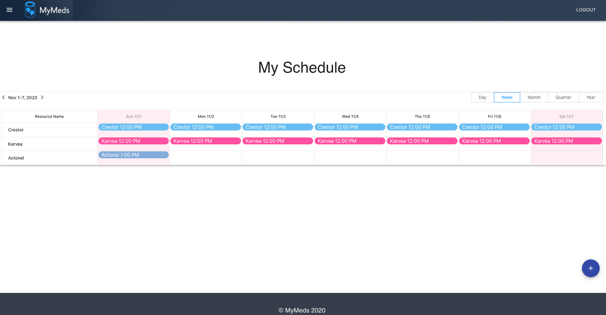

# MyMeds


## Description

An app which helps patients track the medications they are taking.

## Table of Contents

* [Installation](#installation)
* [Usage](#usage)
* [License](#license)
* [Questions](#questions)

## Installation

To install the necessary dependencies, run the following command:

```
npm i
```

## Usage



Then run the following command to start the server.
```
npm start
```

Or click the following link to see the deployed version on Heroku!
https://stormy-journey-46811.herokuapp.com/#/login

## License

This project is licensed under the MIT license.

## Questions

If you have any questions about the repo, open an issue or want to discuss, contact me directly at anna.s.chong@gmail.com. You can find more of my work at [acho9138](https://github.com/acho9138/.).

## Credits

Thank you to the following resources to help make this app possible:

- The Coding Bootcamp at University of Sydney
- React
- Material UI
- MDN
- Stack Overflow
- Heroku
- React Big Calendar
- MongoDB
- Express
- Node
- Moment.js